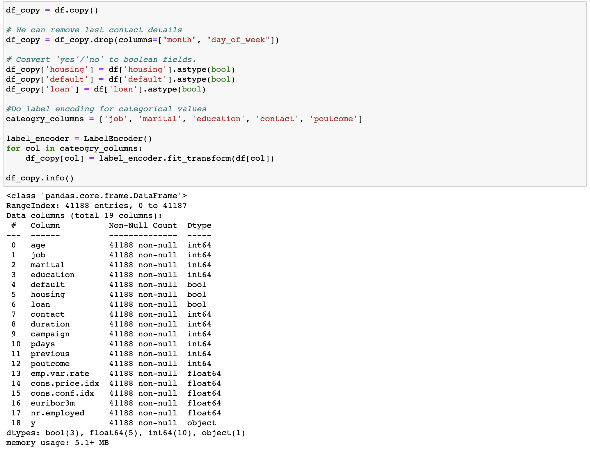
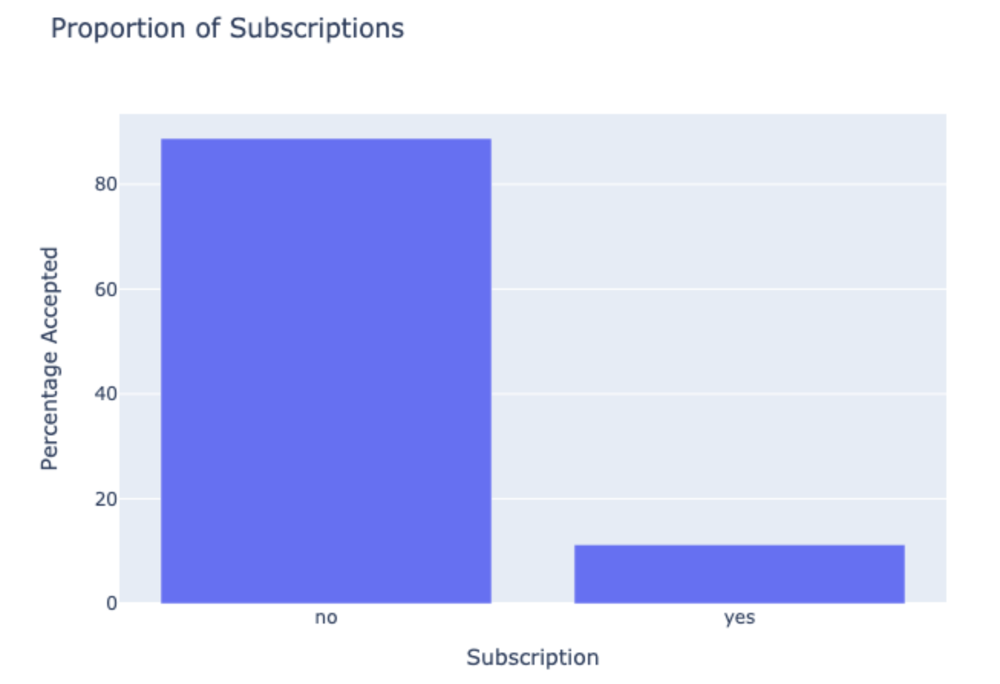
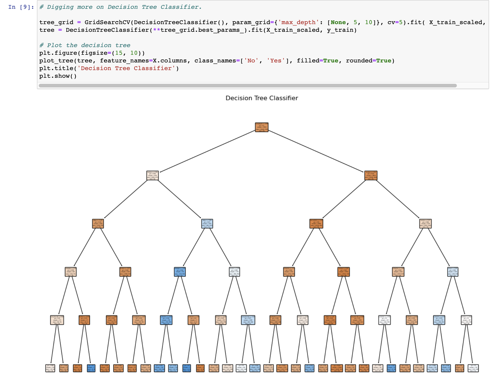
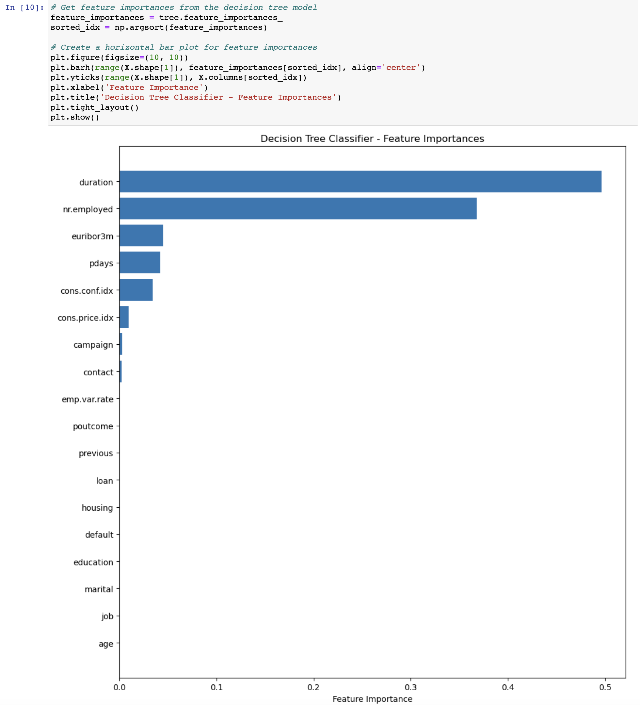
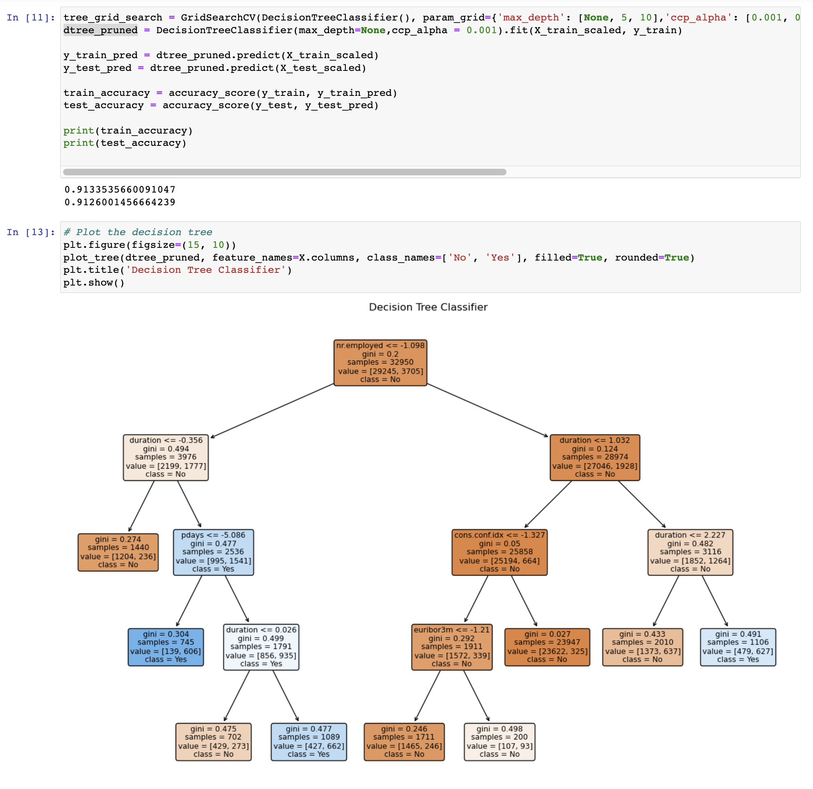
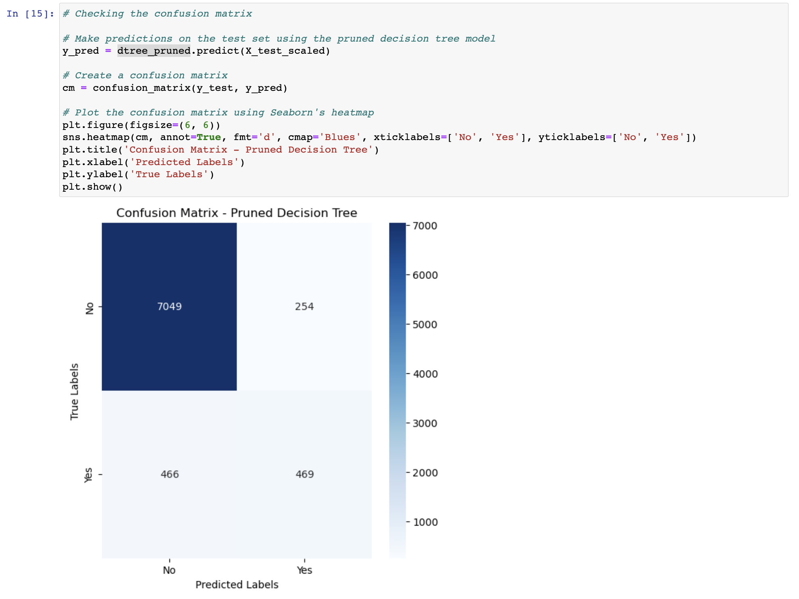
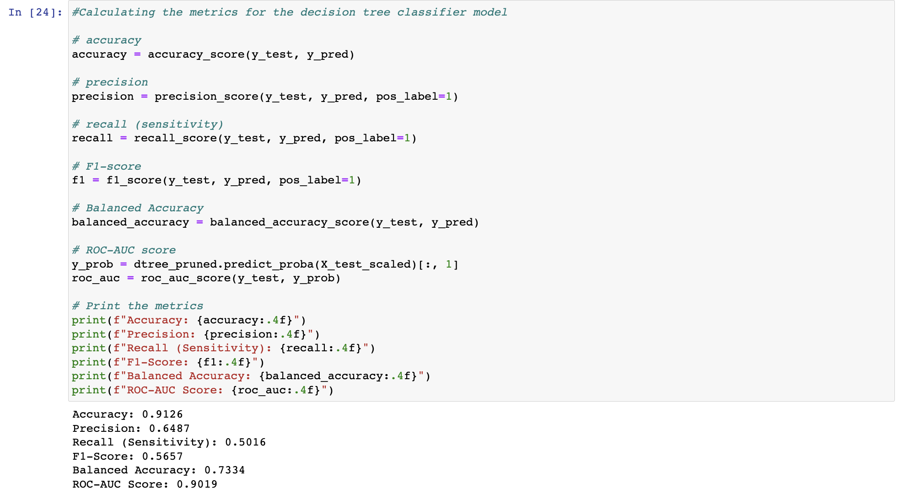

# Comparing Classifiers - Practical Application #3

## Overview

Our goal of this assignment is to compare the performance of the classifiers (k-nearest neighbors, logistic regression, decision trees, and support vector machines) using a [banking dataset](https://archive.ics.uci.edu/dataset/222/bank+marketing) that is related with direct marketing campaigns (phone calls) of a Portuguese banking institution. The classification goal is to predict if the client will subscribe a term deposit (variable y).

## Business Context

This banking dataset helps banking institution to predict the success of their marketing campaign. If the propensity to subscribe the bank product(in this case, a term deposit) is high, tele marketer could prioritize such contact  and thus be productive and yield better results. This would save a lot of time in productivity for tele marketers and improved customer loyality. 

# Data Understanding

### Client Details

| Column      | Feature Type | Description
| ----------- | ----------- | -----------
| age      | Numerical       | Age
| job   |  Categorical | Type of Job ("admin.","unknown","unemployed","management","housemaid","entrepreneur","student", "blue-collar","self-employed","retired","technician","services")  
| marital   |  Categorical | Marital Status ("married","divorced","single"; note: "divorced" means divorced or widowed)
| education   |  Ordinal | Education Level ("unknown","secondary","primary","tertiary")
| default   |  Boolean | has credit in default?
| balance   |  Numeric | average yearly balance, in euros
| housing   |  Boolean | has housing loan? 
| loan   |  Boolean | has personal loan? 

### Last Contact Details
| Column      | Feature Type | Description
| ----------- | ----------- | -----------
| contact      | Cateogrical       | Communication Type
| day   |  Numeric | last contact day of the month
| month   |  Numeric | last contact month of year
| duration   |  Numeric | last contact duration, in seconds

### Past Campaign Outcomes
| Column      | Feature Type | Description
| ----------- | ----------- | -----------
| campaign      | Numeric       | number of contacts performed during this campaign and for this client
| pdays   |  Numeric | number of days that passed by after the client was last contacted from a previous campaign
| previous   |  Numeric | number of contacts performed before this campaign and for this client
| poutcome   |  Cateogical | outcome of the previous marketing campaign

### Output Variable 

| Column      | Feature Type | Description
| ----------- | ----------- | -----------
| y      | Boolean       | has the client subscribed a term deposit? 

# Data Preparation & Analysis

1. Remove columns like day of the month, week.
2. Label encode the category values.
3. Make data type adjustments

### Analysis

1. About 11% of customers in the dataset subscribed to the deposit.

2. There is a lot of boolean and categorical features.. Just by looking at it manually, it looks like the Decision Tree classifier would be a better model for this.

## Modeling & Comparison

Upon running different models, the comparison looks as below:

| Model | Test Score | Train Score | Fit Time | Score Time
| ----- | ---------- | ----------- | -------- | ----------
| Logistic Regression | 0.90 | 0.91 | 0.24 | 0.003
| Decision Tree | 0.91 | 0.91 | 0.27 | 0.004
| KNN | 0.90 | 0.91 | 0.009 | 9.4
| SVC | ... Runs forever |

Looking at the states, Decision looks to perform sligtly better. And SVC is the most expensive one.. Results didn't come even after 10 mins in my laptop.

Digging a bit more on Decision Tree Classification.

Draw a decision tree chart and calculate feature importance.

Feature Importance:

Looking at the feature importance chart, We could prune a lot of unwanted features..

Trying Cost complexity pruning..

The decision tree now looks better..

Calculating Confusion Matrix

Calculating other metrics:

# Deployment, Conclusion & Next Steps

Based on the comparison, Decision tree with right pruning would be a recommended model. 

